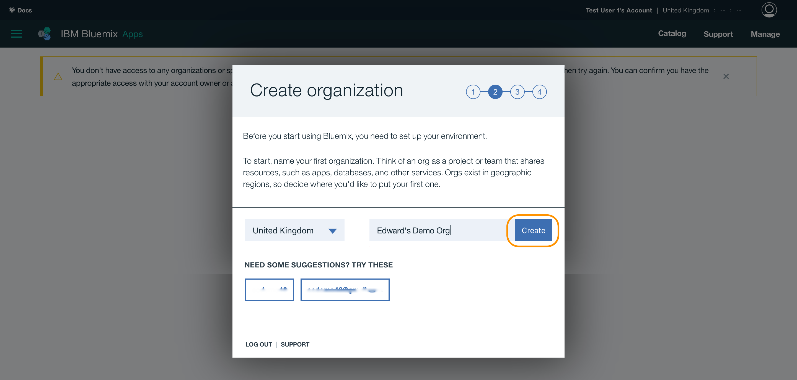

# building-first-ML-model

Learn how to build your first Neural Network on IBM Data Science Experience. 

### Create an IBM Account 

[Sign up to IBM Cloud](https://console.bluemix.net/registration) and create an account then follow the steps below to complete your account setup.

Define a name for your organization.

Choose a name for your space. Typically `dev` would be a good name for your first space.

On the last page, click **I'm Ready** to complete the setup process.

For the remainder of this lab use the **US region** of IBM Cloud. For this, use Ctrl-click (or the equivalent of your system) to open the dashboard. Click your account and choose **US South** as your active region. If you are all OK, you get the dashboard. Otherwise, you will be asked to create your first space in this region. Typically `dev` would be a good name for your space.

Congrats, you're now ready to start your data science experience!!

### Set up Data Science Experience

#### Step 1: Sign up for IBM Data Science Experience

IBM Data Science Experience is an interactive, collaborative, cloud-based environment where data scientists can use multiple tools to activate their insights. In this part of the lab, you will sign up for a 30-day trial of IBM Data Science Experience.

  1.  In a web browser navigate to [https://datascience.ibm.com](https://datascience.ibm.com).

  2.  Click on **Sign Up** at the top right.

  

  3. Click on **Sign in with your IBM id** and enter your Bluemix credentials.

  

  4. Follow the instructions to complete the sign up for IBM Data Science Experience. Note that two Bluemix services will be created for you -- a Cloud Object Storage service and an Apache Spark service. As soon as the 'Get Started' button is clickable, click it and you should be directed to the Data Science Experience dashboard as shown below.

  

#### Step 2. Create a project 

1. Click on the Projects Tab to see a list of your projects. You should only see a default project.

2. Click on the create project icon on the top right of the project list. 

3. Type a name for your project. For instance, "Tensorflow on DSX". A Spark service and an object storage will be automatically selected as well as a container with a default name. A container is a directory on the object storage. Click on Create.

 > You are now in your new project where you can create notebooks and data assets as well as add collaborators.

Create the project and you should 

#### Step 3. Create a New Notebook

1. Once you create the project you should now see the project dashboard.

2. Click on the Add to project button and select Notebook.

3. You can create a blank notebook, but to speed things up, you can select the **From URL** tab and use [this](https://github.com/aounlutfi/building-first-ML-model/blob/master/Tutorial.ipynb) notebook. Then click on Create Notebook and everything should be ready.

## Next Steps...

Having completed the above steps, you can then start following the steps mentioned in the notebook to complete your first ML model.
